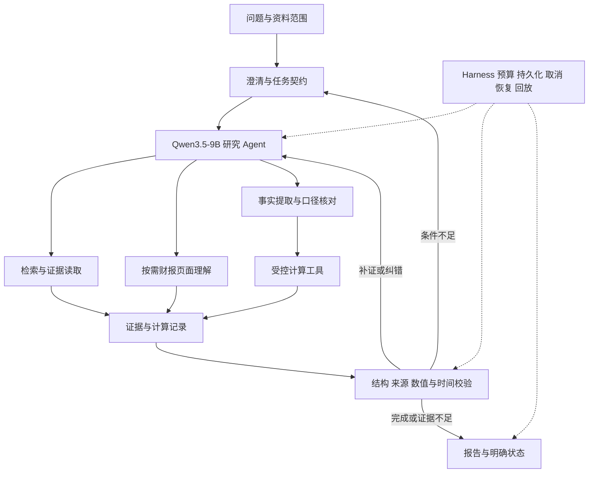

# Qwen3.5-9B 金融财报研究 Agent 与 Harness 开发方案

更新日期：2026-10-05。建设目标：以 **Qwen3.5-9B 为统一生成与工具调用模型**，利用公开金融数据，在单张桌面版 RTX 4090 24GB 上开发可取证、可计算、可追问、可恢复的财报研究系统。

核心路线为 **财报文本与表格理解 → 工具增强推理 → 领域 SFT → 多轮 Agent 与可靠执行 → 财报页面理解**。公开基准先验证英文财报能力，中文公告和新闻舆情作为后续业务扩展。当前阶段为开发设计，文中的配置、数据规模和验收指标均为拟定方案；项目成果以运行记录为准。

## 项目定位和交付范围

建议项目名：**金融财报研究 Agent**。技术副标题：**Qwen3.5-9B 领域后训练、多模态证据理解与可靠执行**。拟用仓库名 `financial_research_agent`。

目标用户需要从财报中核对指标、解释变化、比较期间，并保留可复查的依据。系统交付结构化回答或研究报告，包含公司、期间、口径、指标、计算过程、证据位置和未解决问题。公开基准主要覆盖问答与局部推理；完整研究报告需要另外建设任务评测。

| 能力主线 | 具体技术工作 | 对应岗位价值 |
| --- | --- | --- |
| 领域后训练 | 数据血缘、可执行监督、LoRA、训练与工具增益分离 | 富途、招商算法等后训练与金融应用职责 |
| 金融文档理解 | 表格结构、单位与期间、证据检索、视觉页面取证 | 星元、进门、金融文档与多模态应用职责 |
| 研究 Agent | 工具调用、补证、澄清、多轮约束和完成契约 | 华林、中信、通用 Agent 应用职责 |
| Harness | 可得时间、版本、幂等、取消恢复、回放与故障验收 | 领阅及 Agent Runtime/Harness 职责 |
| 单卡部署 | 模型服务、量化质量、上下文预算、显存与时延测量 | 联易融、航班管家等推理与应用工程职责 |

第一版聚焦财报取证和计算。新闻舆情、估值假设核对可以后续加入；交易、因子回测、资产配置属于另外的算法任务。项目不依赖付费教师模型或商业行情数据库，也不预设必须训练 DPO/GRPO。

## 用户流程和完成标准

| 流程 | 示例问题 | 正确交付 | 必须处理的困难 |
| --- | --- | --- | --- |
| 财务变化核对 | “比较公司 A 两年的收入和经营现金流，计算变化率。” | 原值、单位、期间、公式、结果、证据 | 指标同名、累计与单季、零分母、负基数 |
| 表格与正文联合解释 | “毛利率变化是否能由披露的成本变化解释？” | 计算结果、原文支持、反向证据和解释边界 | 文本与表格交叉引用；相关性不自动等于因果 |
| 多轮研究 | “改成上一年。再看现金流。这两个指标口径一致吗？” | 正确继承与更新公司、期间、指标，必要时澄清 | 指代消解、过期工具结果、跨话题返回原任务 |
| 页面取证 | “这张财报页面里相关数字在哪里，能否核对？” | 页码、行列或区域定位、抽取值和核对结果 | 合并单元格、脚注、低清晰度、OCR 错位 |
| 时间截止研究 | “只使用截至指定日期已公开的资料分析。” | 符合截止规则的资料与版本 | 披露时间、重述公告、资料缺失；需有原始时间元数据 |

前三条形成核心业务版本；页面取证和严格时间截止在对应数据与验证就绪后启用。资料不充分时，交付明确缺口并保存任务。用户可以补充条件、查看来源、取消任务和导出报告。

## 单模型架构和资源分配

Qwen3.5-9B 是带视觉编码器的生成模型，官方提供图文输入和工具调用接入方式，可支撑文本研究和后续页面理解。[Qwen 官方模型卡](https://huggingface.co/Qwen/Qwen3.5-9B)

主运行时加载一份生成模型，同一模型承担规划、信息抽取和回答组织。Embedding/reranker 如后续引入，作为辅助检索模型单独记录；第一版先用 CPU BM25。计算、数据库、解析、权限和任务状态由程序实现。



从固定流程开始：检索 → 抽取 → 计算 → 回答。随后让单 Agent 动态决定补证与澄清，以相同工具和预算做对照。多 Agent 留待出现可测量的上下文隔离或协作收益后再引入。

## 4090 上的可行性验证

Unsloth 当前给出 Qwen3.5-9B BF16 LoRA 约 22GB 的参考显存，并明确不推荐 Qwen3.5 的 4-bit QLoRA 训练，原因是量化差异较大。该数字不是本项目的峰值实测，不能据此保证长序列或多图训练；文档同时要求兼容的 Transformers v5 环境。[Unsloth 微调说明](https://unsloth.ai/docs/models/qwen3.5/fine-tune)

| 场景 | 首选配置与策略 | 验证要求 |
| --- | --- | --- |
| 日常文本 Agent 推理 | 9B 的 4-bit 或 8-bit 推理候选；先限制单请求、上下文与输出预算 | 比较 BF16/量化在固定短任务上的答案、工具调用、显存和时延 |
| 文本领域 SFT | BF16 LoRA、冻结视觉模块、micro batch 1、梯度检查点 | 完整执行前向、反向、优化器更新、保存与重载，覆盖最长允许样本 |
| 视觉页面推理 | 单页或局部区域逐次处理，记录分辨率与视觉 token | 同时测数字准确率和页码/区域定位，不只看能否生成回答 |
| DPO 或视觉微调 | 根据核心版本错误分析另立实验 | 显存与收益均达标后加入主线 |
| GRPO 与长轨迹训练 | 可选研究项 | 不作为单张 4090 第一版交付前提 |

**训练试跑起点**：最大序列 1024，再试 1536/2048；LoRA rank 8，再比较 16；梯度累积 8。先从 100—200 条训练样本抽样完成 20—50 个更新步骤和一次保存重载。上述均是探测参数，不是已证明有效的训练配方。

Qwen3.5 使用混合架构，LoRA 模块应按实际结构选择。实施时枚举实际模块，打印命中的 LoRA 层与可训练参数，确认视觉编码器冻结，核验 loss mask 和工具消息模板。只对计划训练的 assistant 输出计算损失，用户文本与工具观测不作为预测目标。

发生 OOM 时依次检查占用进程、视觉权重与缓存、损失计算内存、序列长度、适配模块和 rank；将长任务拆成局部取证动作，保留证据完整性，不能截掉答案依赖的行列。梯度累积增加有效 batch，不会消除单样本峰值。

如果实测仍无法稳定训练有价值的 9B 样本，保留 9B 推理与 Agent 开发主线，单独报告训练资源缺口。如需租用更大显存卡，仅对具体训练实验评估成本；模型与数据版本保持一致，分别记录开发和训练硬件。

开发优先使用 Linux 或 WSL2 的独立环境，固定模型 revision、依赖与 CUDA 版本。训练与在线推理分时运行，禁止两个 GPU worker 同时常驻抢占。推理后端先完成一种：优先验证 Transformers 的正确输出，再选择兼容的服务后端并固定版本。模型标称上下文长度不等于 24GB 显存可运行长度。

## 公开数据和使用顺序

| 数据源 | 可利用内容 | 在本项目中的角色 | 使用边界 |
| --- | --- | --- | --- |
| [FinQA](https://github.com/czyssrs/FinQA) | 财报正文、表格、问题、参考程序与执行答案 | 数值推理、计算动作监督、程序执行评测 | gold 支持事实和程序只用于训练监督或评分；公开测试与私有测试分开 |
| [TAT-QA](https://github.com/NExTplusplus/TAT-QA) | 财报表格与文本、答案、单位尺度及推导 | 抽取、单位规范化、混合证据问答 | 保持原任务指标；报告局部上下文结果，不冒充全库检索结果 |
| [ConvFinQA](https://github.com/czyssrs/ConvFinQA) | 连续问答、逐轮程序与答案 | 多轮状态、指代与计算结果复用 | 与 FinQA 有来源关系；官方 test 标签不随输入完整提供，不能默认可本地评分 |
| [TAT-DQA](https://github.com/NExTplusplus/TAT-DQA) | 财务文档视觉问答资源 | 页面理解、视觉与文本路线对照 | 继承 TAT-QA 的来源关系；先核验下载资源、标注位置与评分可用性 |
| [SEC EDGAR API](https://www.sec.gov/search-filings/edgar-application-programming-interfaces) | 申报记录、XBRL 财务事实及来源关联 | 真实文档资料库、公开时间、期间与修订研究 | 独立按接口访问要求使用；核对标签、单位、上下文和申报版本 |

第一阶段使用 FinQA 与 TAT-QA 的有标签训练/开发资源；第二阶段接 ConvFinQA；第三阶段接 TAT-DQA 和有来源元数据的真实财报。核心路线无需收集大规模新闻流。

TAT-QA 当前仓库注明数据采用 CC BY 4.0，数据许可与代码许可分别记录。其他数据逐项保存下载版本、许可证、原始链接和再分发范围，不把“公开可下载”视为所有用途均无限制。[TAT-QA 数据许可](https://github.com/NExTplusplus/TAT-QA#license)

中文展示在英文核心版本后建设：选定少量中文上市公司公开财报，记录可使用来源、披露时间和页码，补充人工复核的独立问题。翻译后的英文题属于同源派生数据，不能充当中文真实财报泛化证据。

## 数据治理和评测划分

先建立统一 manifest，至少包含 `dataset/revision/original_split/original_id/source_report_id/company/report_period/language/modality/content_hash/parent_ids/license`。合成轨迹、翻译、页面截图和问题改写全部跟随父文档分组。

采用两种互不混淆的评测协议：

- **原始基准协议**：尽量遵守官方划分与输入格式，保留原指标。合并多个数据集训练时，移除与任一保留测试集同源的训练样本；记录由此变化的训练量。
- **系统泛化协议**：按源报告分组冻结 train/dev/test；另建跨公司或跨期间验证。重新划分的结果明确使用自建协议名称，不冒称官方榜单成绩。

先建立 FinQA—ConvFinQA、TAT-QA—TAT-DQA 的来源映射，再做精确哈希和近重复检查。没有稳定报告 ID 时结合公司、年份、文本和表格指纹，无法判定的跨集合样本先隔离。不能把同份报告截图和文本分别放到训练集、测试集。

gold 字段与原始可见资料物理分开存放。检索索引只收录任务允许的原文、表格和页面，不收录问答答案、参考程序或 gold supporting facts。官方没有公开测试标签的任务，先从有标签资源中冻结未调参的分组留出集；如提交官方评测，另记提交协议和结果。

公开基准可能进入基座预训练，去重只能控制本项目数据泄漏。另建近期原始财报任务以增强外部验证，不声称已经排除基座记忆。

## 监督数据和训练目标

训练重点是正确研究动作、事实口径和可核验回答。第一轮先做 500 条以内的转换与执行检查，再按完整性筛选 2000—5000 条训练实例；这是候选实验规模，由可用样本和学习曲线决定。

| 训练任务 | 目标输出 | 监督来源与检查 |
| --- | --- | --- |
| 证据与事实抽取 | 指标、值、单位、期间、行列/文本位置 | 训练集标注映射到原文；验证引用位置真实存在 |
| 计算工具调用 | 函数名、事实引用、操作与参数 | 将参考程序转换为受控 DSL，执行结果与标注答案核对 |
| 工具结果解释 | 答案、单位、计算引用与简短说明 | 工具返回真实执行结果；核对答案，不凭模板编造解释 |
| 多轮状态更新 | 本轮约束、引用前轮结果、下一动作 | ConvFinQA 有标签训练数据；按会话整体切分 |
| 条件不足和纠错 | 澄清或补证动作 | 从训练资料构造缺列、错单位、缺期间用例并复核 |

示例动作链为 `search_documents → get_evidence → extract_financial_facts → calculate_metric → submit_report`。可用训练集 gold 程序监督计算动作，但工具观察必须从原始训练材料和实际执行产生。gold 证据监督的局部抽取样本，与需要自主检索的完整轨迹分开打标签，不能据前者推断检索规划能力。

无需为每题生成长篇思维链。保留简短的动作理由、公式和证据即可。复杂轨迹可由同一 9B 离线生成候选，再以程序执行、引用和规则筛选；记录这是自生成数据，并抽样复核。最终数字正确仍不足以证明取证正确。

SFT 只在开发集选择学习率、步数、rank 与配比；保留通用工具调用和视觉能力的回归集，检查任务专门化是否损害原有能力。拒答样本需与可回答题配对评估，防止模型用普遍拒答抬高安全类分数。

候选训练对照：基座、答案式 SFT、证据与工具动作 SFT。后续偏好学习针对取错期间、伪造引用、无依据解释等具体错误；在同一数据划分下比较增益。新项目是否保留 DPO/GRPO，由错误分布、奖励可靠性和资源实测决定。

## 证据模型和财务计算

统一证据对象记录 `evidence_id/document_id/version/page/section/table_id/row/column/bbox/source_hash`；位置字段按模态填写，不伪造缺失页码。事实对象记录 `entity/metric/value/unit/currency/scale/period/scope/evidence_ids/status`。其中 `scope` 区分合并与母公司口径，`status` 区分抽取候选、校验通过与需要复核。

字段解析与规则校验通过，仅代表结构和内部一致性，不自动证明抽取值与原文一致。数字、行列、脚注和单位需要回查；关键事实在展示样本中人工复核，评测时由独立标签判断。

计算工具只接受白名单操作和可追溯的事实 ID，使用 Decimal 与显式舍入策略。至少支持加减乘除、比例、差值、同比及聚合。限制操作数、步骤数和耗时，不执行模型输出的任意 Python。

业务计算明确零分母、负基数、百分比与百分点区别。遇到不适宜解释为增长率的负基数，返回差值和说明；公开基准则按其参考程序执行并单独标注协议，不擅自改写评分语义。期间、币种或口径不兼容时先拒绝直接比较。

报告关键数值必须引用事实或计算 ID。计算记录包含输入、操作、结果、单位、版本；报告同时区分披露事实、计算结果和分析推断。确定性校验器可检查 ID 与算术，却不能替代金融因果判断。

## 文档检索与多模态增量

文本路线先保留标题、表头、行列、脚注、单位和页面锚点。原始 PDF 无可靠文本层时再考虑视觉解析。每个 chunk 附文档版本与证据定位，不能把孤立数字作为完整财务证据。

检索实验按 BM25 → BM25 与向量融合 → 重排逐步推进。先固定真实 query 和相关性标签，报告 Recall@k、MRR/nDCG、引用支持率与额外时延。第一版 SQLite 保存任务与证据元数据，BM25 独立索引；需要持久化向量与更高并发时再迁移 PostgreSQL/pgvector，并单独验证迁移。

公开 QA 数据通常给定局部上下文；将其扩成跨文档检索时，另外定义候选文档池、干扰材料、来源分组和相关性标注。局部 QA 得分、全库检索得分、研究任务完成率分别呈现。

多模态阶段比较三条路线：文本解析后回答、9B 页面视觉取证、文本与视觉按需结合。先进行视觉推理评测，再决定是否增加视觉 LoRA。页面路由依据表格解析失败、文本缺失或证据冲突触发，控制 GPU 串行调用。

实验按原文档配对，统一问题和输出预算，单独报告图像分辨率、页数与视觉 token。人工遮挡关键单元格、调整单位标注、加入相似年份页面后检查结果变化；合成扰动按原文档分组，避免统计上当作全新的独立样本。

只有在输出与标注都具有可验证位置时才计算区域定位指标；TAT-DQA 下载资产和标注需要在接入时核验。页面理解成功不能自动等同于精确 bbox 定位。业务报告保留页面截图与文本证据之间的映射。

## Agent 工具和状态契约

| 工具 | 主要职责 | 必须满足的约束 |
| --- | --- | --- |
| `resolve_entity` | 公司名称、代码及候选解析 | 多候选必须澄清 |
| `search_documents` | 根据问题检索允许材料 | 查询继承任务的范围、快照和时间约束 |
| `get_evidence` | 读取原文、表格或页面 | ID 在允许资料内，返回真实来源位置 |
| `extract_financial_facts` | 从证据抽取财务事实 | 记录模型/模板与来源，抽取后校验；避免递归调用自身 |
| `calculate_metric` | 执行受控计算 | 验证单位、期间、口径、操作白名单 |
| `ask_user` | 澄清缺失条件 | 真实挂起并持久化原问题及待答字段 |
| `submit_report` | 提交报告和业务结果 | 检查证据与计算引用，事务中写入版本 |

页面理解作为 `get_evidence` 或抽取链路的一个显式模式，由同一模型串行执行；并发上限为 1 时，外层 Agent 不能持锁等待另一个永远取不到锁的模型请求。

执行状态使用 `queued/running/succeeded/failed/cancelled/interrupted`；业务状态使用 `answered/awaiting_input/insufficient_evidence/blocked`。执行成功、JSON 合法、引用存在和任务正确分开记录。`awaiting_input` 表示仍有待继续的研究任务，不计入已完成回答。

状态保存原始问题、当前目标、公司、期间、as-of、资料快照、证据 ID、计算结果、预算和待澄清项。每次条件变更使依赖旧条件的结果失效，禁止直接沿用上一家公司或上一期间的缓存。

长期记忆首版仅保留明确偏好与可追溯摘要，恢复任务以持久化状态为准。上下文压缩保留来源映射和冲突事实；checkpoint 与跨任务 memory 分开存储和验收。

## 金融时间与资料版本

时间字段至少区分 `report_period/published_at/ingested_at/version/supersedes/snapshot_id`。历史公开资料查询要求 `published_at <= as_of`；回放“系统当时已知信息”时，还要约束 `ingested_at`。报告期不能替代披露时间，缺失披露元数据时不提供严格 PIT 保证。

原始 FinQA/TAT-QA 局部资料主要验证理解与计算；严格截止场景使用附申报元数据的原始财报或其他可核验来源另行建设。文档、结构化事实、检索候选、记忆、缓存和最终引用都执行相同的版本与时间规则。

修订数据保存历史版本，不直接覆盖旧值；查询使用符合截止条件的版本。参数记忆可能包含未来知识，因此只能声称受控访问和报告引用符合截止规则，不能声称完全消除模型的前视知识。

## Harness 的实现和故障验收

现有宠物 Agent 的请求幂等、主管/执行器、SSE、取消和崩溃恢复机制可以提取复用；金融任务必须重新验收。既有离线回归数量和真实模型结果不迁移成新项目成绩。

| 机制 | 实现目标 | 关键验收案例 |
| --- | --- | --- |
| 任务幂等 | request_id 与输入哈希绑定，报告版本唯一 | 同 ID 重试不重复提交；不同输入返回冲突 |
| 提交一致性 | 报告与提交事件在事务中落盘，恢复先检查提交状态 | 报告已写、checkpoint 未写时崩溃，不重复生成或提交 |
| GPU 与进程管理 | 单 GPU 租约、有限队列、推理 worker 生命周期 | 超时/取消后资源释放；OOM 清理后健康检查通过才恢复 |
| 取消与恢复 | 取消信号传播到生成端，预算和原任务持久化 | HTTP 断开不被误认为 GPU 已停止；长生成可终止 |
| 工具缓存 | 输入、快照、公司、期间、as-of 和工具版本共同入键 | 切换公司/时间后不返回旧事实；过期结果失效 |
| 预算限制 | 限制工具轮数、输出 token、时长与可重试次数 | 循环补证被停止，报告明确失败或资料缺口 |
| 时间与数值守卫 | 外部约束由代码强制执行 | 截止日后材料、修订版本、单位错配被发现 |
| 外部内容隔离 | 文档视为资料，工具白名单和参数校验独立执行 | 财报内嵌指令不能改变任务权限或导出范围 |
| 追踪回放 | 持久化输入、观察、版本、状态与时间 | 区分缓存回放和重新推理；相同来源快照可重查 |

模型服务若独立于任务 worker，杀掉任务进程并不保证停止推理；明确请求取消接口或 worker 回收机制。外部调用遇到未知执行结果记录 `unknown outcome`，不宣称未经验证的 exactly-once。

SSE 发送真实节点和持久化事件游标；节点进度与模型 token 流分别标识。SQLite 首版限定单机串行写入和低并发；多租户授权、分布式队列与高可用属于独立扩展，不能从单用户演示推断。

## 评测矩阵与结果解释

| 层级 | 主要指标 | 结果应回答的问题 |
| --- | --- | --- |
| 官方任务 | FinQA 执行/程序指标；TAT-QA 官方 EM/F1 等 | 是否掌握数据集要求的抽取和计算 |
| 多轮任务 | 逐轮正确率、整段会话正确率、约束继承 | 首轮错误是否传播，后续是否正确使用状态 |
| 检索与证据 | Recall@k、引用存在率、引用支持率 | 找到材料与材料支持结论分别怎样 |
| 财务口径 | 单位、期间、币种、范围和数值正确率 | 算对公式是否仍使用了错误事实 |
| 研究 Agent | 按题目预期判定的任务成功率、错误断言率 | 回答、澄清、证据不足是否正确选择 |
| 多模态 | 页面问答、表格抽取、可验证位置准确性 | 视觉输入具体改善哪些错误 |
| Harness | 恢复、幂等、取消、状态与资源一致性 | 故障后是否保存正确业务结果并释放资源 |
| 性能 | 完整任务 P50/P95、真实 TTFT、token、峰值显存 | 收益需要多少推理、检索和运行成本 |

核心对照依次为：

1. **基座直接回答 vs 基座加计算工具**：相同证据条件下测工具收益。
2. **基座 Agent vs SFT Agent**：相同资料、工具、量化方式和预算，测训练收益。
3. **答案式 SFT vs 证据与动作 SFT**：尽量控制训练来源和样本规模，记录 token 差异。
4. **固定流程 vs 单 Agent**：测动态补证和澄清是否值得额外调用。
5. **BM25 vs 混合检索 vs 重排**：固定生成模型，隔离检索收益。
6. **文本 vs 视觉 vs 按需结合**：同源文档配对，记录额外视觉成本。
7. **BF16 vs 量化推理**：记录精度、工具调用与时延变化，不混成微调收益。

基座与适配器使用各自正确的官方模板，并保存模板哈希、thinking 设置与解析规则。相同任务尽量固定总预算；若某方案使用更多 token，单列质量与成本，不把额外推理全部归因于训练。

先设计约 40 个系统开发任务，再冻结约 80 个独立验收任务，建议覆盖 30 个财务计算、20 个跨证据核对、15 个多轮澄清、15 个资料不足/冲突任务。严格时间与视觉用例随相应阶段追加独立分组。规模是建设目标，不能写成已有测试成绩。

每题保存允许材料、期望业务状态、正确事实、证据和评分规则。计算用确定性评分，开放解释人工抽样复核；同一 9B 不作为自己输出的唯一裁判。自动评分、人工评审、真实模型任务和脚本模型故障测试分开报告。

官方指标采用对应脚本；自建数值容差与舍入规则在评分前冻结。配对差值按报告或会话组计算区间，避免把同源问题当作独立样本。全部失败尝试计入时延与成本，单独报告缓存命中。

## 分阶段开发和停止条件

| 阶段 | 必须交付 | 进入下一阶段的条件 |
| --- | --- | --- |
| M0 单卡与数据可行性 | 模型/依赖清单、推理和训练显存记录、数据 manifest、划分审计 | 9B 推理稳定；完整训练步骤与重载可运行，或明确训练资源缺口；数据协议冻结 |
| M1 财报取证与计算 | FinQA/TAT-QA 适配、证据模型、受控计算器、固定流程基线 | 训练和评分资料隔离；可复现实验；典型抽取/计算错误能定位 |
| M2 领域 SFT | 可执行监督转换、LoRA、基座/答案式/动作式对照 | 保存模型与逐题结果；独立报告质量和成本；无收益时保留基座方案 |
| M3 单 Agent 与 Harness | 动态取证、追问、状态、幂等、取消恢复、真实模型任务集 | 核心故障不变量验收通过；业务任务质量单独评分；同一环境可重复运行 |
| M4 文档库与时间约束 | 原始财报索引、混合检索对照、披露与修订版本、快照 | 能完成跨文档任务；严格时间例题有可核验来源，未来材料不可进入上下文 |
| M5 多模态和中文验证 | TAT-DQA 接入、页面取证对照、独立中文材料 | 证明视觉在哪些场景有收益，报告中文迁移结果与边界 |
| M6 服务与展示 | 简单 UI、报告导出、部署说明、MCP/Skill 可选交付 | 干净环境可启动；演示、实验版本和报告来源一致 |

M1 后已有公开数据上的财报问答基线；M3 构成第一版完整工程交付；M4 才支撑较完整的研究资料库与 PIT 表述；M5 增加多模态和中文金融证据。后续阶段不阻塞前面已完成成果的整理。

质量不预设必达 95% 或固定提升幅度。开发集上的新方案若无稳定收益、成本失控或破坏通用能力，就保留基线并记录失败归因。所有标为“必须”的状态与幂等不变量应在定义的故障用例中通过；失败项修复或缩小交付范围后再验收。

## 代码组织和工程规范

拟建独立目录 `D:\Bucv\financial_research_agent`，以下为模块设计，并非已生成代码：

```text
financial_research_agent/
  configs/                 模型 数据 训练 运行与评测配置
  data/manifests/           来源 许可 划分与派生关系
  src/data/                数据适配 去重 轨迹转换
  src/evidence/            文档 表格 页面 事实与版本
  src/retrieval/           BM25 融合 重排与过滤
  src/tools/               类型化工具 计算 DSL 与校验
  src/model/               模板 推理服务与适配器加载
  src/training/            loss mask LoRA 与训练检查
  src/agent/               状态 规划 澄清与报告
  src/harness/             队列 租约 幂等 取消 恢复与追踪
  src/evaluation/          官方适配 业务评分 消融与性能
  src/service/             API SSE 与展示接口
  tests/                   关键业务不变量和故障验收
  docs/                    架构 数据卡 模型卡 实验与部署
  artifacts/               版本化运行结果 本地模型引用
```

项目单独管理数据清单、模型版本、训练配置和评测记录。模型加载、模块适配、损失处理和服务输出均按 Qwen3.5 的实际结构与模板验证，所有成果来自本项目的可复现实验。

从宠物 Agent 提取完成契约、幂等和恢复设计，去除业务路由与宠物规则；从 Omni 复用多模态受控对照和数据治理方法。新仓库各里程碑维护架构、结果与已知限制，来源和个人新增模块在 README 中清楚说明。

MCP 在业务工具验收后接入，先暴露文档检索、证据读取和计算工具。Skill 可设置 `financial-metric-review`、`report-evidence-review`、`period-comparison`，包含输入契约、工具范围、失败处理和样例。运行时实际加载、执行并留下轨迹后再计入成果。

## 项目成果和求职展示

最终作品应提供四类可复查材料：模型与训练配置、公开基准逐题结果、完整研究任务轨迹、故障恢复与资源测量记录。演示至少覆盖财报计算、连续追问、资料不足，以及中断恢复；多模态阶段再加入页面取证。

面向金融 AI 岗位，优先展开单位/期间/版本、证据检索和财务计算；面向 Agent 岗位，优先展开任务契约、工具选择、GPU 取消与恢复；面向多模态岗位，重点展示文本与页面对照、位置验证和解析失败处理；面向后训练岗位，重点展示监督构造、loss mask、数据隔离和收益归因。

完成相应阶段后可使用的项目描述方向：

> 基于 Qwen3.5-9B 构建金融财报研究 Agent，将财报证据定位、财务口径核对、受控计算与多轮研究组织为可追踪任务；通过可执行监督开展领域适配，并以分层评测验证模型、检索和工具的独立收益。

多模态、中文、PIT、MCP 及训练提升只在对应阶段验收后加入描述。当前主简历仍保留已有真实经历，新项目按实际交付逐步替换项目池中的展示位置。
